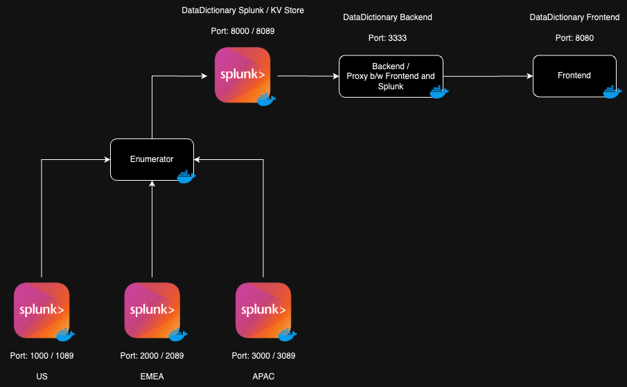

# Splunk Data Dictionary
### Components
* 3 Splunk Instances (US,EMEA,APAC)
* 1 Splunk Instance (DataDictionary , KV Store)
* Splunk Enumerator (Watcher / Collection Framework)
* Backend (Nodejs)
* Frontend (React w/ Splunk UI Toolkit)

## Installation
* Install Docker Desktop 
* Once Docker Desktop is running , from the 'splunk_data_dictionary' directory , use command 
```docker compose up -d```.
* 7 Docker containers will be started , wait for all splunk instances to initialize, Check the 'enumerator' container logs to see if all Splunk hosts are ready and serving.
* Run the shell script 'prepareKv.sh' in splunk_enumerator directory , to create the required collections , when setting up for first time.



## Flow
* Enumerator discovers all the splunk hosts based on a json config file [config.json](https://github.com/uvish/splunk_data_dictionary/blob/main/splunk_enumerator/config_docker.json).
* It runs a scan for all objects every 5 seconds and creates an update list, which is then pushed to a KV collection in Splunk Data Dictionary Instance.
* Backend Application can connect to the KV store in Data Dictionary Splunk and expose endpoints based few CRUD operations.
* Frontend uses the above endpoints for showing on the dashboard and few other operations.

## Ports :
* 8080 : Frontend Application
* 3333 : Backend API / Proxy Server
* 1000 | 1089 : Splunk US UI | API
* 2000 | 2089 : Splunk EMEA UI | API
* 3000 | 3089 : Splunk APAC UI | API
* 8000 | 8089 : Splunk DataDictionary UI | API

## Credentials
All splunk instances use ```admin / Uvish123@``` as username and password for admin account.